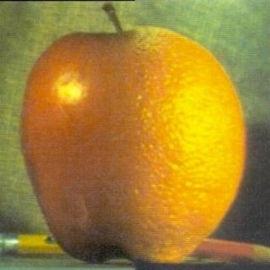
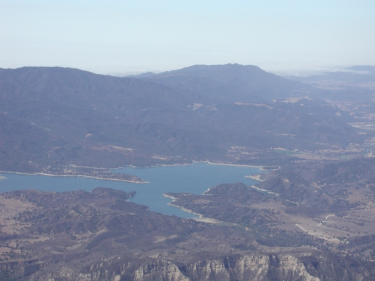
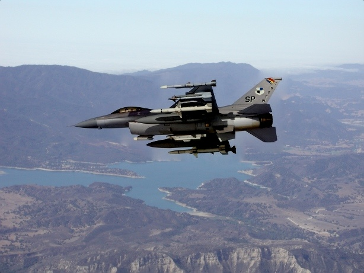

# image-blending
Image blending is the process of blending a source onto a target image with a mask such that it appears that
the source is blending nicely into the target image's background. It can be implemented in a variety of ways. I have
implemented Pyramid Blending and Poisson Blending.

The repo is organized in three folders:
- **Code :** `main.py` contains the main blending code that works for images one to nine. `getMask.py` can be used to generate a mask for a given image.
- **Images :** This folder contains all the source, target and mask images. They are numbered one to nine.
- **Results :** This is the folder where the generated results are stored. All the blends for images one to nine are present here.

## Running Code

To run the code, Python 3 and the following libraries must be installed:
- numpy
- cv2
- scipy
- matplotlib

Then simply use the following command to run with python:
```
python3 main.py
```


Examples of the blending are given below:

## Pyramid Blending

Pyramid Blending is not as good as Poisson Blending, but can work well in certain cases.
A good example is blending the source image of an apple:


with an orange


using Pyramid Blending results in this:



## Poisson Blending

Blending the following source:


with the following target:



results in the following:




